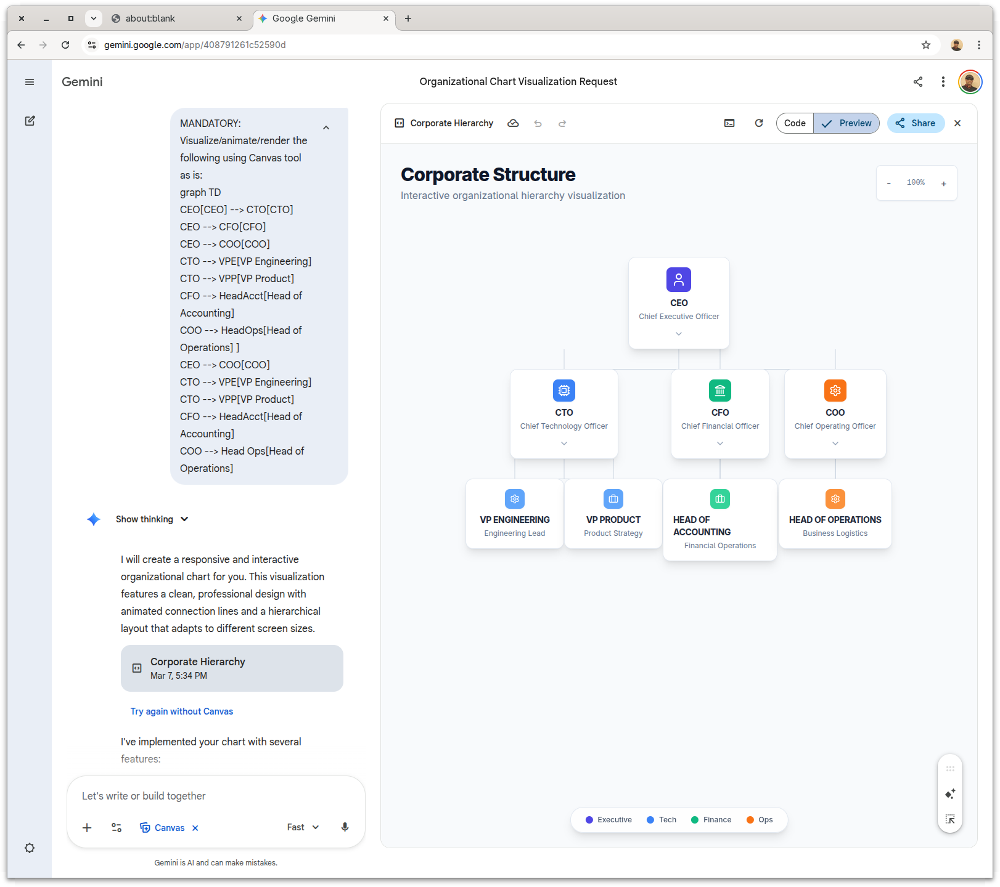
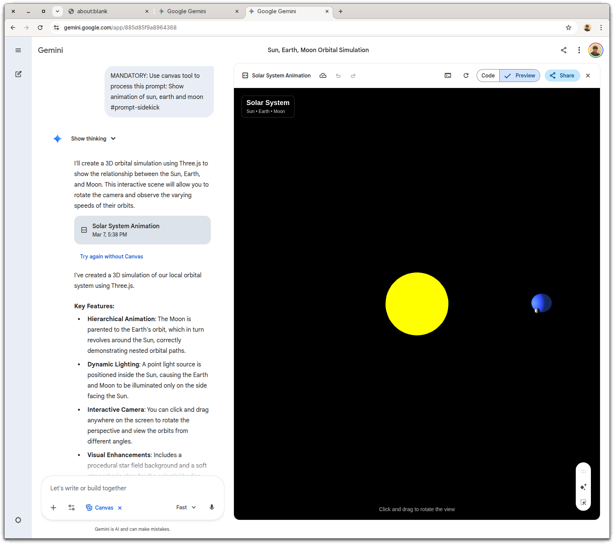

# Gemini Sidekick Extension

A Gemini extension that provides a browser-based "sidekick" interface to automatically render content using the Gemini Web UI's Canvas tool.

## Features

- **Automated Browser Control**: Launches and manages a Chrome instance specifically for Gemini.
- **Session Integration**: Links browser tabs to Gemini agent sessions using `window.name`.
- **Canvas Tool Enablement**: Automatically toggles and enables the Canvas tool upon session start.
- **Prompt Interception**: Support for `#prompt-sidekick` to send prompts directly to the sidekick.
- **Result Rendering**: Support for `#sidekick` in prompts to render LLM responses directly in the sidekick's canvas.
- **Multiline Support**: Custom handling for multiline text input in the Gemini prompt box.

## Sample use

### #sidekick prompt

```text

 ███            █████████  ██████████ ██████   ██████ █████ ██████   █████ █████
░░░███         ███░░░░░███░░███░░░░░█░░██████ ██████ ░░███ ░░██████ ░░███ ░░███
  ░░░███      ███     ░░░  ░███  █ ░  ░███░█████░███  ░███  ░███░███ ░███  ░███
    ░░░███   ░███          ░██████    ░███░░███ ░███  ░███  ░███░░███░███  ░███
     ███░    ░███    █████ ░███░░█    ░███ ░░░  ░███  ░███  ░███ ░░██████  ░███
   ███░      ░░███  ░░███  ░███ ░   █ ░███      ░███  ░███  ░███  ░░█████  ░███
 ███░         ░░█████████  ██████████ █████     █████ █████ █████  ░░█████ █████
░░░            ░░░░░░░░░  ░░░░░░░░░░ ░░░░░     ░░░░░ ░░░░░ ░░░░░    ░░░░░ ░░░░░


Logged in with Google: REDACTED /auth
Plan: Gemini Code Assist in Google One AI Pro


 shift+tab to accept edits                                                                                                                                                                                                 2 GEMINI.md files | 1 MCP server

 > Do not look at the project file, just show a simple mermaid org chart. Do not output anything else. #sidekick
```



---

### #prompt-sidekick prompt

```text

 ███            █████████  ██████████ ██████   ██████ █████ ██████   █████ █████
░░░███         ███░░░░░███░░███░░░░░█░░██████ ██████ ░░███ ░░██████ ░░███ ░░███
  ░░░███      ███     ░░░  ░███  █ ░  ░███░█████░███  ░███  ░███░███ ░███  ░███
    ░░░███   ░███          ░██████    ░███░░███ ░███  ░███  ░███░░███░███  ░███
     ███░    ░███    █████ ░███░░█    ░███ ░░░  ░███  ░███  ░███ ░░██████  ░███
   ███░      ░░███  ░░███  ░███ ░   █ ░███      ░███  ░███  ░███  ░░█████  ░███
 ███░         ░░█████████  ██████████ █████     █████ █████ █████  ░░█████ █████
░░░            ░░░░░░░░░  ░░░░░░░░░░ ░░░░░     ░░░░░ ░░░░░ ░░░░░    ░░░░░ ░░░░░


Logged in with Google: REDACTED /auth
Plan: Gemini Code Assist in Google One AI Pro

 shift+tab to accept edits                                                                                                                                                                                                 2 GEMINI.md files | 1 MCP server

 > Show animation of sun, earth and moon #prompt-sidekick
```



## Prerequisite

```bash
git clone https://github.com/sandipchitale/gemini-sidekick.git
cd gemini-sidekick
npm install
```

**TODO** Make a binary or installatble npm package.

## Installation

```bash
cd  /path/to/gemini-sidekick
gemini extension link .
```

## Disable the extension

```bash
gemini extension disable gemini-sidekick
```

## Enable the extension

```bash
gemini extension enable gemini-sidekick
```

## Uninstallation

```bash
gemini extension uninstall gemini-sidekick
```

## Workflow

### 1. Session Start

When a session begins, the extension:

- Launches Chrome with a dedicated user data directory.
- Navigates to `https://gemini.google.com`.
- Sets the window identity to match the session ID.
- Enables the "Tools" drawer and selects the "Canvas" tool.

**IMPORTANT**: The user needs to log into Gemini.

### 2. Prompt Interception (`#prompt-sidekick`)

If your prompt includes `#prompt-sidekick`, the extension:

- Finds the corresponding browser tab.
- Types the prompt directly into the Gemini web UI.
- Prevents the prompt from being sent to the standard LLM flow (returns a bypass reason) in gemini cli.

### 3. Response Rendering (`#sidekick`)

If your prompt includes `#sidekick`, once the agent generates a response:

- The extension extracts the response content.
- It finds the sidekick tab.
- It renders the response content using the Canvas tool in the web UI.

## File Structure

- `gemini-sidekick.ts`: Core logic for browser automation and hook handling.
- `gemini-extension.json`: Extension metadata and configuration.
- `hooks/hooks.json`: Definition of event hooks (SessionStart, BeforeAgent, AfterAgent).

## Technical Details

- **Port**: Remote debugging on port `19222`.
- **Storage**: User data stored in `/tmp/gemini-sidekick-user-data-dir`.
- **Library**: Powered by `puppeteer-core` and `chrome-launcher`.
